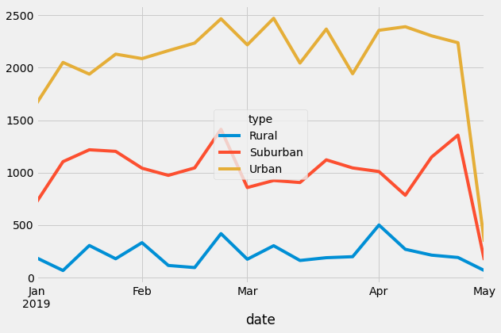

# PyBer_Analysis
Module 5 Project

## Overview of Project
### Purpose
This report summarizes data on ride sharing by city type per V.Isulaize request.  Multiple-line graphs will be provided to show the total weekly fares for each city type.  A summary of how the data differes by city type and how those difference can be used for decision making by Pyber is also included int this report.

## Results

TTotal weekly fares are highest for urban territories and lowest for rural territories almost during all period of observation. Fares for all territories seem to go up towards the end of February and then take a dip in the beginning of March.
.

## Summary

